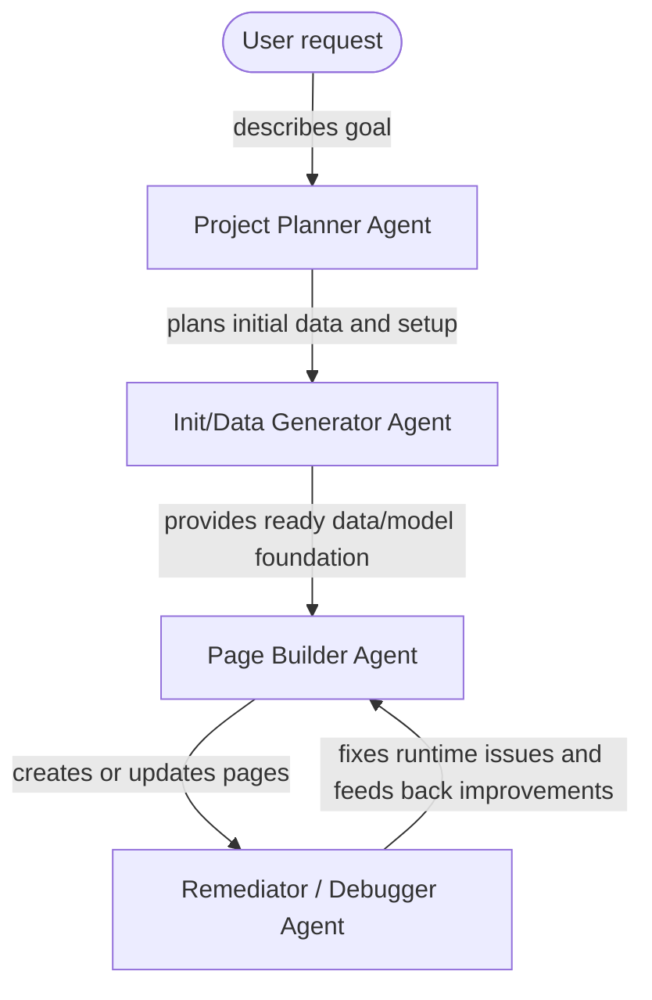

# Instant-UI -- Powerful Showcases. Instantly

InstantUI turns ideas into working demo-pages fast.

We built a set of AI-assisted tools for creating, inspecting, and fixing demo pages directly from app metadata, runtime logs, and real browser feedback. Instead of guessing widget configs by hand, InstantUI reads the model, understands the objects and attributes available, and helps produce page JSON that actually belongs in the app.

## What We Do

InstantUI helps teams move from “we need a page for this” to a usable demo interface in minutes.

It can:

- create new pages from natural language requests
- inspect app models before using object or attribute aliases
- generate useful demo data and setup foundations
- build dashboards, tables, charts, forms, and navigation pages
- diagnose runtime errors from log IDs
- fix invalid relation paths, aggregations, sorters, and chart configs
- use browser feedback to verify and improve generated pages

## Typical Workflow

1. Describe the page or demo you want.
2. InstantUI plans the required page, data, and setup.
3. It generates or prepares the initial data foundation.
4. It builds the page using existing app conventions.
5. You open the page in the browser.
6. If the page logs an error, InstantUI traces the log ID and fixes the root cause.
7. The page is refined until it works as a usable demo.

## Agents

The **Project Planner Agent** turns the request into a concrete plan. Saves this as a plan.md document

The **InitDB/Data Generator Agent** prepares the initial database schema and sets up test-data

The **Page Builder Agent** creates or updates pages from that foundation.

The **Remediator / Debugger Agent** checks runtime issues, fixes page problems, and loops improvements back into the page builder workflow.
