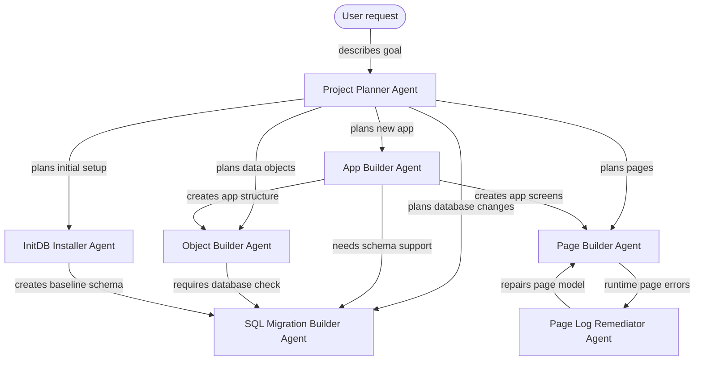

# Instant-UI -- Powerful Showcases. Instantly

InstantUI turns ideas into working demo-pages fast.

We built a set of AI-assisted tools for creating, inspecting, and fixing demo pages directly from app metadata, runtime logs, and real browser feedback. Instead of guessing widget configs by hand, InstantUI reads the model, understands the objects and attributes available, and helps produce page JSON that actually belongs in the app.

## What We Do

InstantUI helps teams move from “we need a page for this” to a usable demo interfaces in minutes.

It can:

- create new pages from natural language requests
- inspect app models before using object or attribute aliases
- build dashboards, tables, charts, forms, and navigation pages
- diagnose runtime errors from log IDs
- fix invalid relation paths, aggregations, sorters, and chart configs

## Typical Workflow

1. Describe the page you want.
2. InstantUI inspects the app model.
3. It creates a page using existing conventions.
4. You open it in the browser.
5. If the page logs an error, InstantUI traces the log ID and fixes the root cause.

The ExFace agent setup is organized around specialist handoffs. An overview of the possible workflows can be seen below

## Agents

The **Project Planner Agent** turns a request into concrete work and hands it to the right specialist.

The **App Builder Agent**, **Object Builder Agent**, **Page Builder Agent**, and **SQL Migration Builder Agent** create or update the main project parts. Object changes always go through the SQL migration builder afterward.

The **InitDB Installer Agent** handles setup and installation. The **Page Log Remediator Agent** loops back into page work when runtime errors appear.
